# CHAPTER FOUR

## SYSTEM IMPLEMENTATION, TESTING AND RESULTS

### 4.1 Introduction

This chapter presents the implementation of the Face Authentication Examination Attendance System (FAEAS) described in Chapter Three. It documents the tools and technologies used to build the system, provides a walk-through of each implemented module with supporting screenshots, describes the strategy adopted for testing the system, and discusses the results obtained, including the practical engineering challenges encountered during development and how they were resolved.

FAEAS was implemented as three cooperating applications rather than a single monolith:

1. A **web portal** (Laravel + Inertia.js + React) used by the Admin for onboarding-related administrative tasks and by students for self-service onboarding.
2. A **mobile application** (Expo/React Native) used by invigilators to take attendance on the examination floor.
3. A lightweight **face-matching microservice** (Node.js) that performs the actual biometric comparison on behalf of the web portal.

This separation reflects the different environments each user interacts with: the admin and student use a browser, while the invigilator, who must move around an examination hall, needs a camera-equipped handheld device.

---

### 4.2 Implementation Environment

#### 4.2.1 Hardware Requirements

| Component | Minimum Specification |
|---|---|
| Processor | Intel Core i3 (or equivalent) and above |
| RAM | 8 GB (16 GB recommended for running the web server, mobile bundler and face-matching service concurrently) |
| Storage | 5 GB free disk space |
| Camera | Front-facing camera on the student's device (onboarding) and on the invigilator's smartphone (attendance capture) |
| Network | A local area network (LAN) or Wi-Fi hotspot connecting the invigilator's phone to the server machine |

#### 4.2.2 Software Requirements and Justification

| Layer | Technology | Justification |
|---|---|---|
| Backend framework | Laravel 12 (PHP 8.2+) | Mature MVC framework with a built-in authentication system, Eloquent ORM, migrations, and a large ecosystem of first-party packages (Sanctum, Excel import) that map directly onto the project's requirements. |
| Server-side rendering bridge | Inertia.js v2 | Allows the React frontend to be built as if it were a single-page application while routing, controllers and validation remain in Laravel — avoiding the need to hand-build and maintain a separate REST API for the web portal. |
| Web frontend | React 19, TypeScript, Tailwind CSS v4, shadcn/ui | TypeScript enforces type safety across forms and API payloads; Tailwind and shadcn/ui provided a consistent, accessible component library so effort could be spent on application logic rather than rebuilding UI primitives. |
| Database | SQLite (development) | Zero-configuration, file-based database suitable for local development and demonstration; the application is written against Laravel's database abstraction layer and can be pointed at MySQL/PostgreSQL in production by changing only the `.env` configuration. |
| Bulk data import | maatwebsite/excel (Laravel Excel) | Provides row-by-row validation and per-row failure reporting when the Admin bulk-uploads students from a spreadsheet, rather than an all-or-nothing import. |
| Facial recognition (browser) | face-api.js (TensorFlow.js) | A production-grade JavaScript face-detection and face-recognition library that runs entirely client-side in the student's browser during onboarding, requiring no server-side GPU. |
| API authentication | Laravel Sanctum | Issues lightweight personal access tokens for the invigilator mobile app without the overhead of a full OAuth2 server, appropriate for a first-party mobile client. |
| Face-matching microservice | Node.js, Express, face-api.js, `@napi-rs/canvas`, `@tensorflow/tfjs` | A small, independent service that accepts a photo and returns a 128-dimensional face descriptor, keeping the biometric processing decoupled from the main Laravel request lifecycle. |
| Mobile application | Expo (React Native) SDK 54, Expo Router, TypeScript | Enables a single TypeScript codebase to run on both Android and iOS and to be tested instantly on a physical device through Expo Go, which was important given the project's single-developer timeline. |
| Automated testing | Pest PHP (built on PHPUnit) | Expressive, readable syntax for writing feature tests against Laravel routes, used throughout development to verify each module as it was built. |

---

### 4.3 Description of System Modules

#### 4.3.1 Public Landing Page

The system's landing page (Figure 4.1) introduces FAEAS and provides separate entry points for the two categories of human users who access it through a browser — students and staff (Admin/Invigilator) — while the invigilator's day-to-day attendance work happens on the mobile application described in Section 4.3.9.

**Figure 4.1:** Public Landing Page
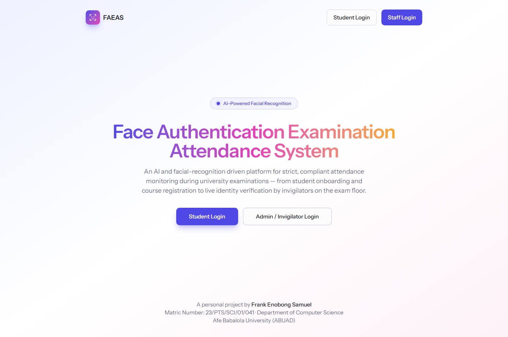

#### 4.3.2 Admin Authentication

The Admin and Invigilator (for any web-based account management) authenticate using an email address and password (Figure 4.2), issued when their account was created. This is deliberately kept separate from the student login, which uses a matriculation number instead of an email address, since a newly onboarded student does not have an email address until Onboarding Step 2 (Section 4.3.6).

**Figure 4.2:** Admin/Invigilator Login Page
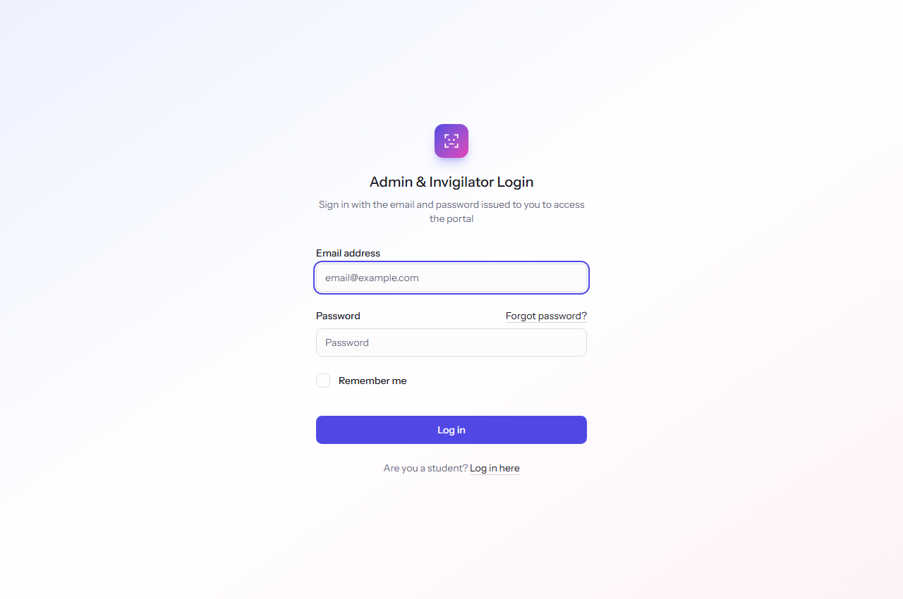

#### 4.3.3 Admin Dashboard

On logging in, the Admin is presented with a dashboard (Figure 4.3) summarising the current state of the system: number of schools, departments, students, invigilators and courses, and the currently active academic session. Each statistic is colour-coded for quick visual scanning.

**Figure 4.3:** Admin Dashboard
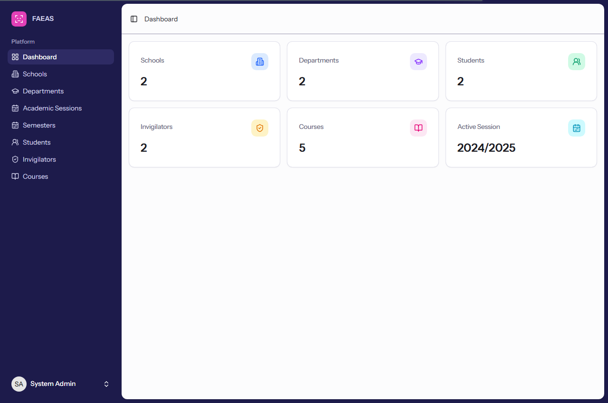

#### 4.3.4 Academic Structure Management (Schools, Departments, Courses)

The Admin creates **Schools** and links **Departments** to a School (Figures 4.4 and 4.5), and creates **Courses** scoped to a Department and academic level (Figure 4.6). **Academic Sessions** and **Semesters** are managed similarly, with a single "activate" action that automatically deactivates any previously active session/semester, guaranteeing that only one session and one semester are ever active at a time — this invariant is enforced at the service layer (`AcademicSessionService`) inside a database transaction so it cannot be violated even by a concurrent request.

**Figure 4.4:** Schools Management
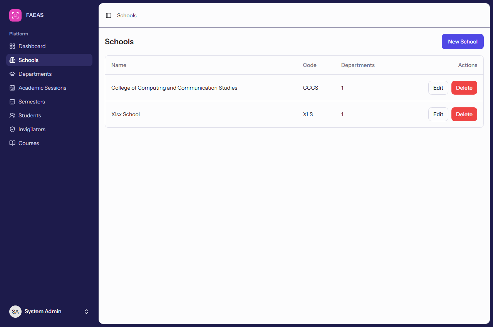

**Figure 4.5:** Departments Management
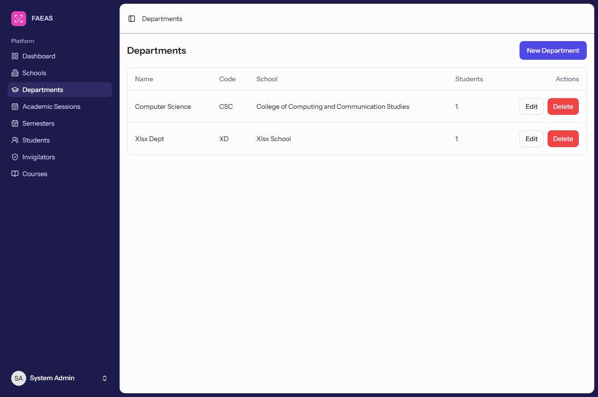

**Figure 4.6:** Courses Management
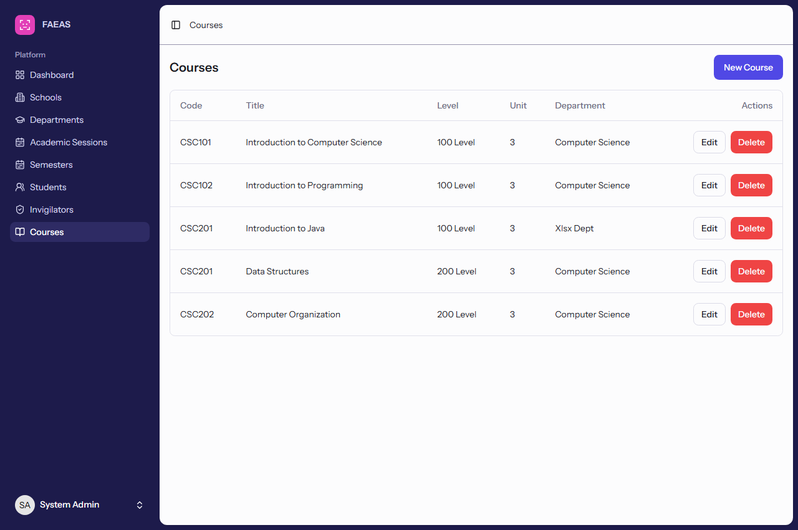

#### 4.3.5 Student Records and Bulk Onboarding

The Admin can view every student's onboarding progress at a glance (Figure 4.7) and bulk-create student accounts by uploading an Excel/CSV spreadsheet (Figure 4.8) containing Matric Number, Full Name, Department, an optional default password (defaulting to `1234567` when left blank), and exam credentials. Each row is validated independently — a row referencing a non-existent department, or duplicating a matric number already in the system, is rejected and reported back to the Admin with the exact reason, while every valid row in the same file is still imported. The Admin also creates **Invigilators** (Figure 4.9) by supplying a name, email and password, which becomes that invigilator's login on the mobile application.

**Figure 4.7:** Student Records
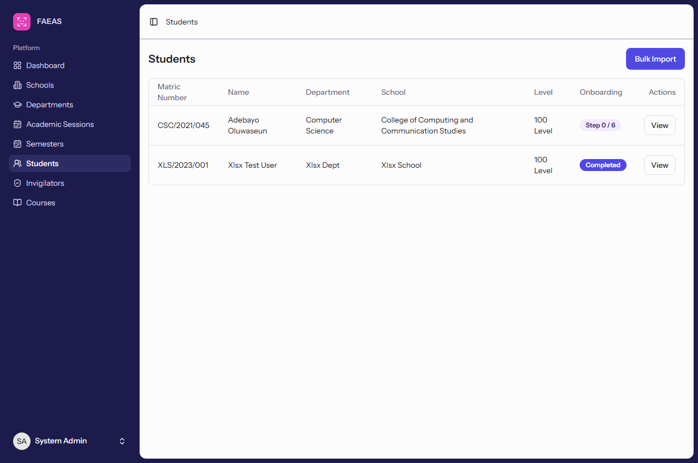

**Figure 4.8:** Bulk Student Import
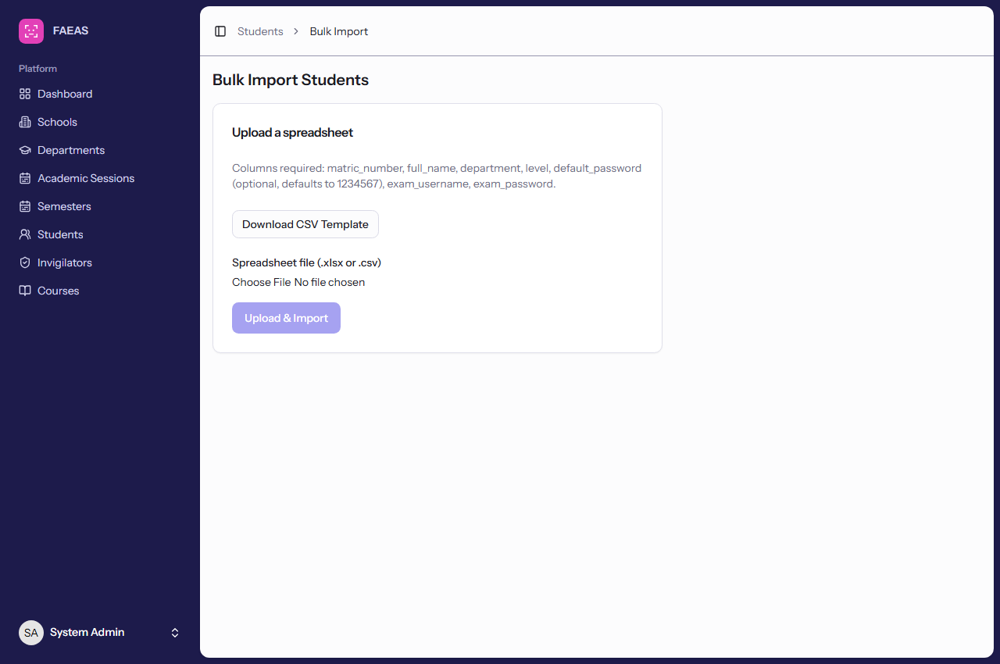

**Figure 4.9:** Invigilator Management
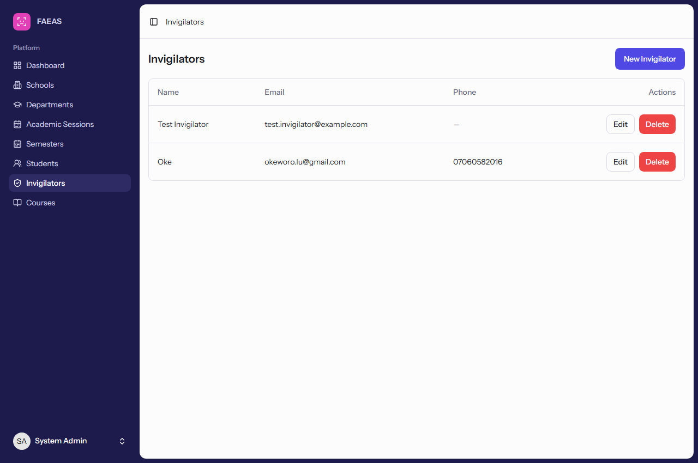

#### 4.3.6 Student Login and Forced Password Change

A student logs in with their matriculation number and the default password set by the Admin (Figure 4.10). On first login, the system detects the `must_change_password` flag on the account and redirects the student to a mandatory password-change screen (Figure 4.11) before any other part of the portal becomes reachable — this is enforced by middleware on the server side, not merely hidden in the interface, so it cannot be bypassed by navigating directly to another URL.

**Figure 4.10:** Student Login Page
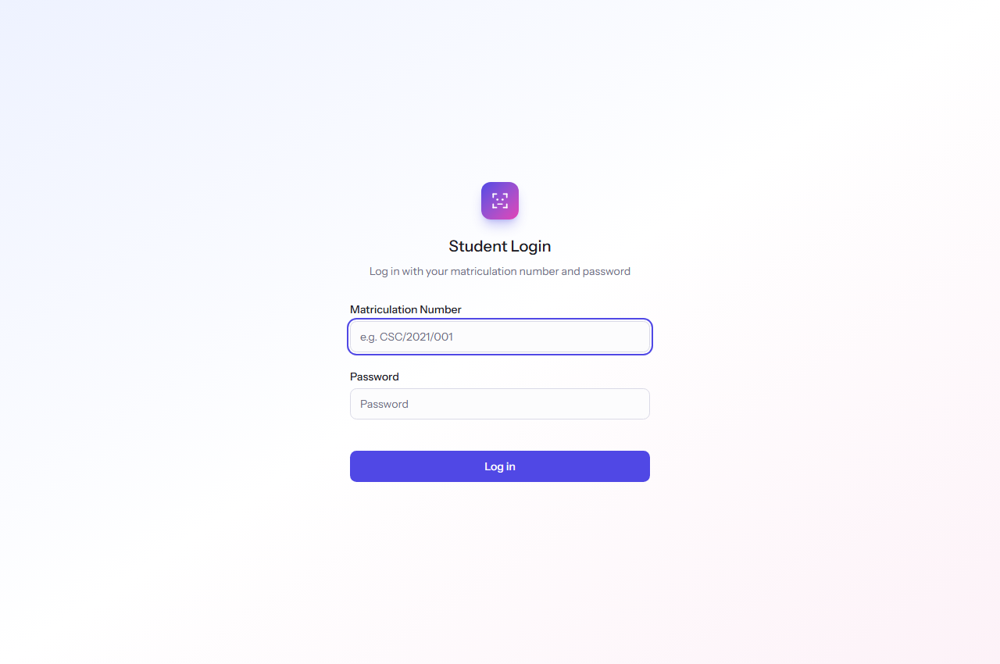

**Figure 4.11:** Forced Password Change
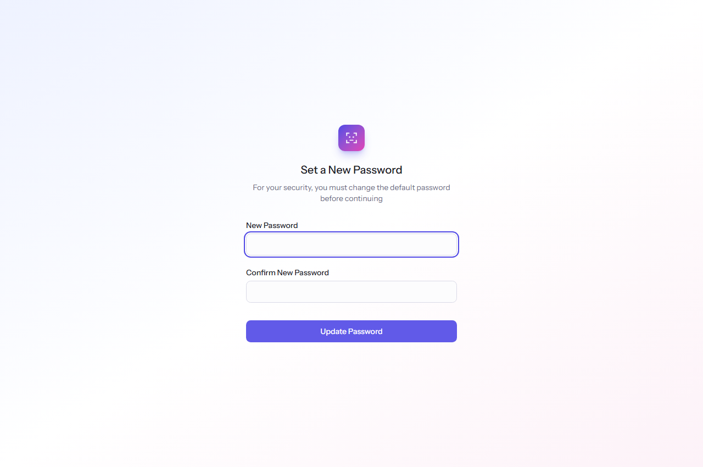

#### 4.3.7 Six-Step Onboarding Wizard

After changing their password, the student is guided through a six-step onboarding wizard. Progress is persisted to the database after every step (`students.onboarding_step`), so a student who closes the browser mid-way and logs back in later resumes at the exact step they left off, and attempting to skip ahead by editing the URL is blocked server-side and redirected back to the correct step.

**Step 1 — Identity Confirmation.** The student reviews their full name and matriculation number as uploaded by the Admin and confirms it is correct (Figure 4.12).

**Figure 4.12:** Onboarding Step 1 — Confirm Identity
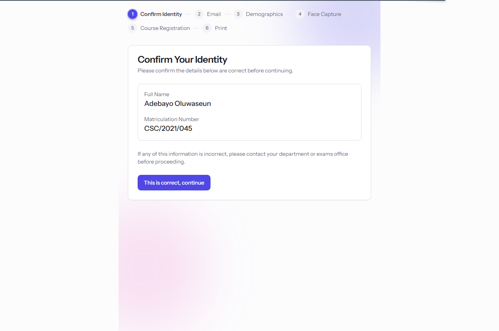

**Step 2 — Email Address.** The student supplies a personal email address, which replaces the placeholder address assigned at import time and becomes usable for future account communication (Figure 4.13).

**Figure 4.13:** Onboarding Step 2 — Email Address
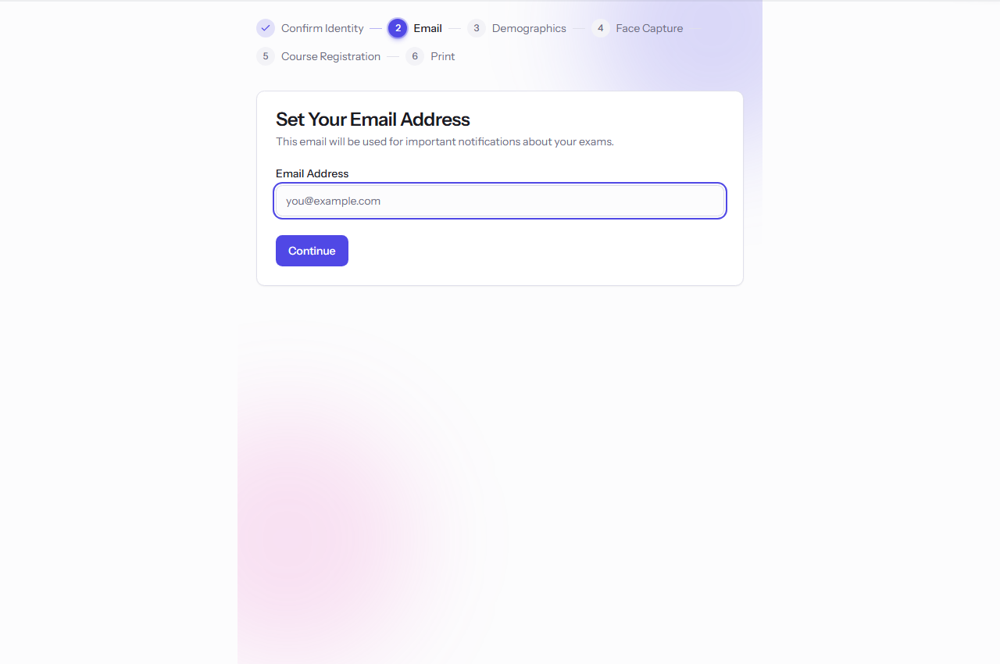

**Step 3 — Demographics.** The student records their gender and date of birth (Figure 4.14).

**Figure 4.14:** Onboarding Step 3 — Demographics
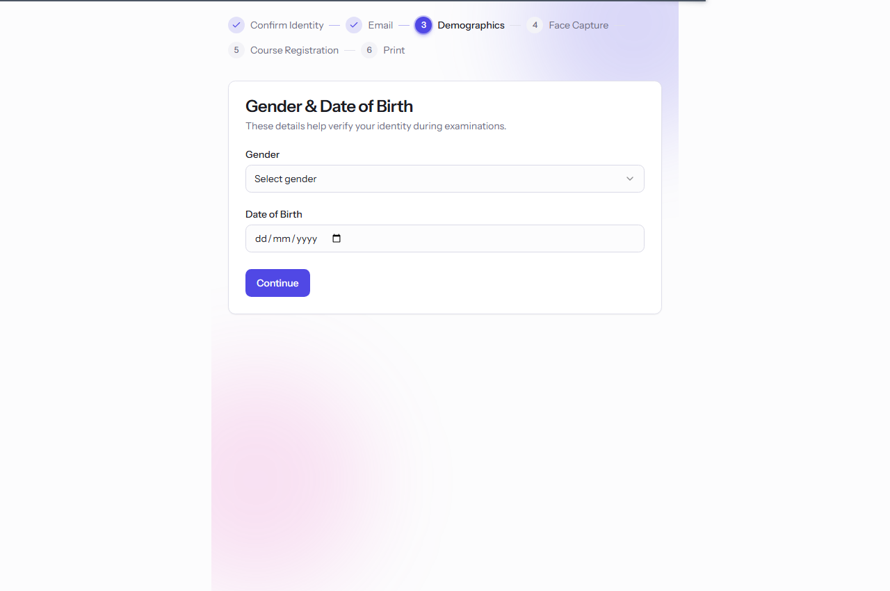

**Step 4 — Live Face Capture.** Using `face-api.js`, the browser loads a tiny face detector, a 68-point facial landmark model and a face recognition model directly onto the student's device. The page requests access to the webcam, detects a single face in the live video feed, and — on capture — extracts a **128-dimensional face descriptor** (a numerical vector uniquely characterising the geometry of the detected face) alongside a snapshot photo. Both are uploaded and stored against the student's record; the descriptor becomes the biometric reference used later by the invigilator's mobile application (Figure 4.15). The interface explicitly rejects a frame in which no face, or more than one face, is detected, and allows the student to retake the photo before submitting.

**Figure 4.15:** Onboarding Step 4 — Live Face Capture
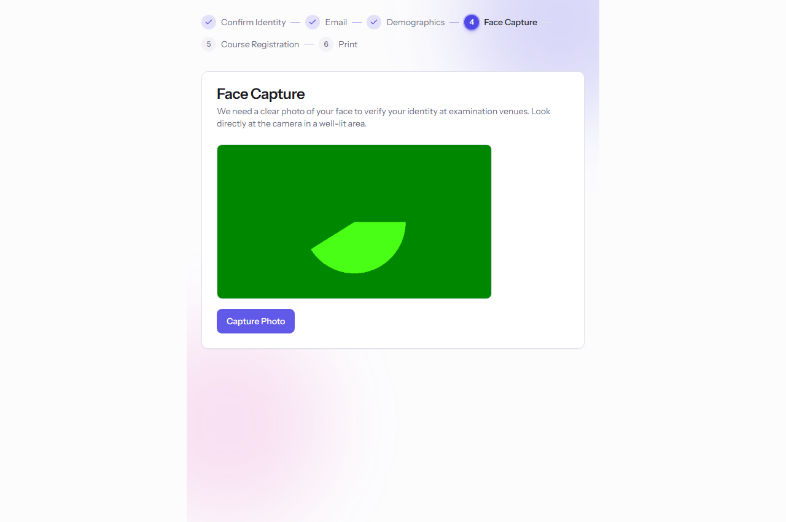

**Step 5 — Course Registration.** The system lists only the courses that match the student's own department and academic level for the currently active session and semester, and the student selects the courses to register for (Figure 4.16).

**Figure 4.16:** Onboarding Step 5 — Course Registration
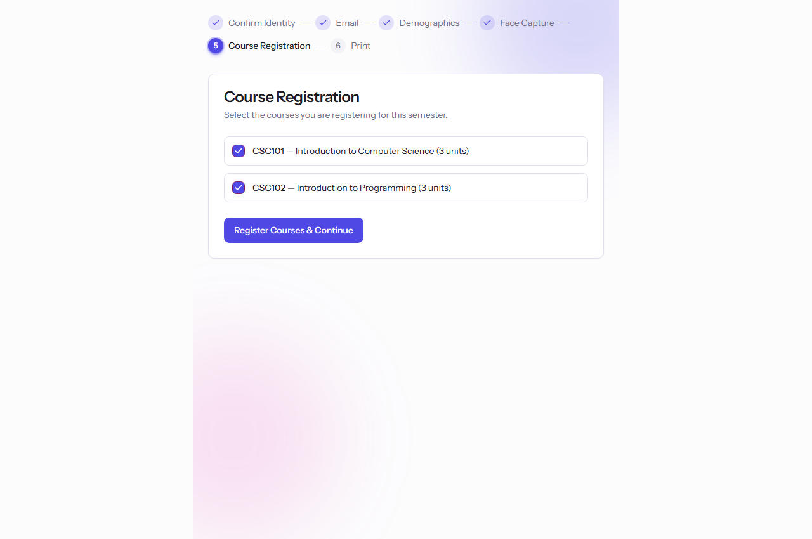

**Step 6 — Print/Summary Page.** The final step assembles the student's passport photograph, full name, matriculation number, department, school and level onto a printable summary (Figure 4.17), which the student may print for physical records. Selecting "Continue to Dashboard" marks onboarding as complete and moves the student to their dashboard for all future logins.

**Figure 4.17:** Onboarding Step 6 — Print / Summary Page
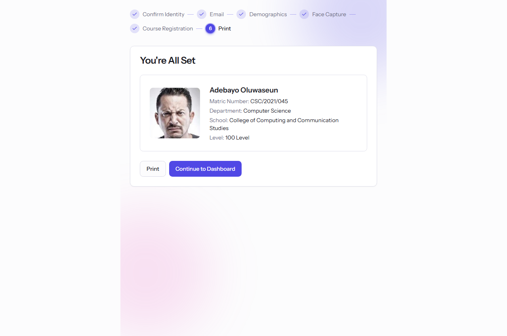

#### 4.3.8 Student Dashboard

Once onboarding is complete, subsequent logins take the student directly to a dashboard (Figure 4.18) showing their profile photograph and the list of courses they registered for.

**Figure 4.18:** Student Dashboard
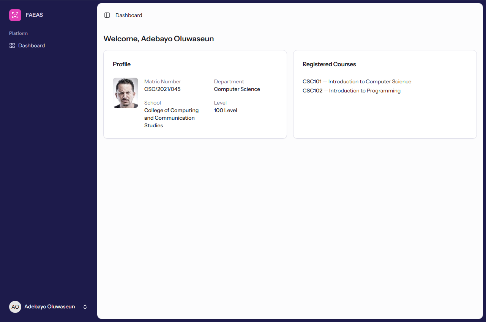

#### 4.3.9 Invigilator Mobile Application

The invigilator installs the FAEAS mobile application (built with Expo/React Native) and logs in using the email and password created for them by the Admin (the same credentials, authenticated through a Laravel Sanctum API token rather than a browser session). The application then presents:

- A list of courses that have students registered against them in the currently active academic session/semester.
- For a selected course, a list of the registered students who have completed onboarding (and therefore have a stored face descriptor and photograph), together with their current attendance status.
- A capture screen where the invigilator photographs the student presenting for the examination.

*(Figures 4.19–4.21: Invigilator login, course/student list, and capture screens — to be inserted from a physical-device screenshot, since the mobile application is exercised on a handheld device rather than a desktop browser.)*

#### 4.3.10 Face-Matching Microservice and Attendance Verification

When the invigilator captures a photo on the mobile application, it is uploaded to the Laravel API, which in turn forwards it to the Node.js face-matching microservice. That service — using the same `face-api.js` model family as the browser-based onboarding step, so that both descriptors live in the same embedding space — extracts a fresh 128-dimensional descriptor from the captured photo and returns it to Laravel. Laravel then computes the **Euclidean distance** between this newly captured descriptor and the descriptor stored for that student at onboarding, and converts the distance into a **match percentage** using the formula:

```
score = max(0, 1 − min(distance, 1.2) / 1.2) × 100
```

A configurable distance threshold (default 0.6, set via `FACE_MATCH_DISTANCE_THRESHOLD`) determines whether the two descriptors are considered a match. If the score is above the threshold, the invigilator can confirm attendance with a single tap. If it is below the threshold, the application displays a "Face Mismatch" warning but still allows the invigilator to exercise judgement — marking the student present anyway (an overridden match, recorded distinctly for audit purposes) or marking them absent. Every one of these decisions is written to the `attendances` table together with the match score, so a complete, timestamped audit trail exists for every attendance decision taken during an examination.

---

### 4.4 Database Implementation

The system's persistent state is organised around the following principal entities: `users` (holding the `role` discriminator — Admin, Invigilator or Student — the login credential, and a `must_change_password` flag), `schools` and `departments`, `academic_sessions` and `semesters`, `students` (department, level, gender, date of birth, encrypted exam credentials, passport photo path, face descriptor, and onboarding progress), `invigilators`, `courses`, `course_registrations`, and `attendances` (student, course, invigilator, session, semester, match score, decision status and timestamp). Relationships are enforced with foreign-key constraints, and the "single active session/semester" business rule described in Section 4.3.4 is enforced in application code rather than left to the interface alone.

---

### 4.5 System Testing

#### 4.5.1 Testing Strategy

The system was tested using a combination of **automated feature testing** and **manual system testing**.

Automated tests were written with **Pest**, a testing framework built on PHPUnit, and were developed alongside each module rather than after the fact — each new controller, form request, or middleware was accompanied by tests exercising both its expected ("happy path") behaviour and its validation/authorisation boundaries. At the time of writing, the automated suite comprises **62 tests and 217 assertions**, all passing, organised as follows:

| Test Suite | What it Verifies |
|---|---|
| `Admin/AdminCrudTest` | Admin can create/update/delete schools, departments, courses and invigilators; duplicate department names within a school are rejected; non-admin and guest users are forbidden from admin routes. |
| `Admin/RouteBindingSmokeTest` | Route-model binding resolves the correct record on edit/update routes (a defensive regression test after a route-parameter naming mismatch was discovered and fixed — see Section 4.6.2). |
| `Admin/StudentImportTest` | Bulk Excel/CSV import creates valid rows, rejects rows with an unknown department or a duplicate matric number, and honours a custom default password when supplied. |
| `Student/StudentOnboardingFlowTest` | Matric-number login, forced password change, and step-by-step onboarding progression, including that a student cannot skip ahead and correctly resumes at the right step after logging out and back in. |
| `Student/FaceCaptureTest` | The face-descriptor upload endpoint stores exactly a 128-length descriptor and the passport photo, rejects a malformed descriptor, and enforces that earlier onboarding steps are already complete. |
| `Student/CourseRegistrationAndCompletionTest` | Course registration is scoped to the student's own department/level, and onboarding is only marked complete after the print step is reached. |
| `Api/InvigilatorAuthTest` | Only users with the Invigilator role can obtain a Sanctum token; wrong credentials and non-invigilator accounts are rejected; tokens are revoked on logout. |
| `Api/InvigilatorAttendanceTest` | The attendance "check" endpoint returns a match score without persisting a record; the "store" endpoint commits an attendance row with the invigilator's chosen status; a student can be marked absent without a photo. |
| Pre-existing starter-kit suites (`Auth`, `Settings`, `Dashboard`) | Confirms the underlying Laravel authentication and profile-settings scaffolding continued to function correctly throughout the modifications made to it. |

#### 4.5.2 Sample Test Cases

| Test ID | Description | Input | Expected Output | Actual Output | Status |
|---|---|---|---|---|---|
| TC-01 | Student login with default password | Matric number + `1234567` | Redirect to forced password-change screen | Redirected as expected | Pass |
| TC-02 | Skip-ahead prevention | Authenticated student at onboarding step 2 requests step 5 directly by URL | Redirected back to step 2 (formerly step 3, per current progress) | Redirected correctly | Pass |
| TC-03 | Bulk import with an unknown department | Spreadsheet row referencing "Nonexistent Department" | Row rejected with a named reason; other valid rows still imported | 1 row imported, 2 rows reported as failures, matching the injected test data | Pass |
| TC-04 | Face descriptor validation | Descriptor array of 50 numbers instead of 128 | HTTP 422 validation error | 422 returned with a `descriptor` validation error | Pass |
| TC-05 | Invigilator login rejected for non-invigilator | Correct password for a Student account | HTTP 422, no token issued | 422 returned, no token issued | Pass |
| TC-06 | Face match — identical photo | Same photograph submitted at onboarding and at "capture" | Euclidean distance of 0, match score of 100% | Distance 0.0, score 100%, `is_match = true` | Pass |
| TC-07 | Face match — different subjects | Two visibly different face photographs compared | Distance well above the 0.6 threshold, `is_match = false` | Distance 1.83, `is_match = false` | Pass |
| TC-08 | Single active academic session | Activating Session B while Session A is active | Session A automatically deactivated | Confirmed via automated test and manual verification | Pass |

#### 4.5.3 Manual System Testing

In addition to the automated suite, the complete system was exercised end-to-end manually:

- The Laravel/Inertia web application was launched with `php artisan serve` and driven with a headless browser to walk through the entire administrator workflow (creating a school, department, courses, an invigilator, and importing students) and the entire student onboarding workflow (login → forced password change → all six onboarding steps → dashboard), confirming that every screen rendered correctly and that no unhandled errors appeared in the browser console.
- The face-matching microservice was tested in isolation by submitting real photographs directly to its `/descriptor` endpoint and confirming that a 128-length descriptor was returned, and that comparing a photograph against itself produced a distance of `0` (a 100% match), while comparing two different subjects produced a materially larger distance.
- The mobile application was installed on a physical Android device via Expo Go and used to log in as an invigilator, browse courses and registered students, and capture a photograph for attendance verification against the running face-matching service, over the same local Wi-Fi network as the development machine.

---

### 4.6 Results and Discussion

#### 4.6.1 Face-Matching Accuracy

Table 4.1 (Section 4.5.2, TC-06/TC-07) demonstrates the two extremes of the matching algorithm's behaviour: an identical image reduces to a Euclidean distance of exactly zero (a 100% match score), while two different individuals produce a distance well outside the configured 0.6 threshold. This confirms that the chosen distance-to-percentage conversion and threshold produce a sensible, and adjustable, separation between "same person" and "different person" for the purpose of this system. Because the final decision on a borderline or failed match is still placed in the hands of the invigilator — who can see the two photographs side by side and the numeric score before confirming or overriding — the system is designed to assist human judgement rather than to fully automate a high-stakes decision without recourse, which is appropriate given the consequences of a false rejection during a live examination.

#### 4.6.2 Engineering Challenges Encountered

Several non-trivial implementation issues arose during development and are documented here because they materially affected architectural decisions:

- **Native dependency build failures.** The face-matching microservice was originally designed around `node-canvas` and `@tensorflow/tfjs-node`, both of which require a native C++ compiler toolchain (Python and a C++ build environment) to install. On the development machine used for this project, this toolchain was unavailable, and both packages failed to install. The service was re-implemented using `@napi-rs/canvas`, which ships prebuilt binaries requiring no local compilation, and the pure-JavaScript `@tensorflow/tfjs` backend in place of the native Node backend. This trades a slower inference time (acceptable, since the service only ever processes one photograph at a time rather than a live video stream) for a build that works reliably on any machine without additional native tooling — a meaningful consideration for a project that may need to be reproduced or graded on a different computer.
- **API incompatibility between library replacements.** Swapping the canvas implementation was not a drop-in change: `face-api.js` internally calls `new Canvas()` with no arguments and expects the canvas library to accept that, whereas `@napi-rs/canvas`'s constructor requires explicit width and height. A small compatibility shim (a custom `createCanvasElement` factory supplying a placeholder size that `face-api.js` immediately resizes) was written to bridge this difference.
- **Expo SDK/Expo Go version mismatch.** The mobile application was initially built against Expo SDK 57, but the publicly distributed Expo Go client (the app used to run the project on a phone without a custom build) only supported SDK 54 at the time of testing, producing an "incompatible" error with no remedy on the phone itself. Diagnosing this required querying Expo's own version-compatibility API programmatically rather than assuming that "downloading the latest Expo Go" would resolve it, since the SDK the mobile client actually supports can lag behind the most recently released SDK. The project was subsequently pinned to SDK 54.
- **Local network configuration for the mobile client.** Because the invigilator's phone and the Laravel server are physically separate devices, the mobile application could not reach the API using `localhost`/`127.0.0.1` — an easy mistake to make since that address is precisely correct when testing in a desktop browser on the same machine. The correct configuration requires (a) starting Laravel bound to `0.0.0.0` rather than only `127.0.0.1`, (b) pointing the mobile application at the server machine's actual LAN or hotspot IP address, and (c) ensuring the operating system firewall permits inbound connections on the relevant port. This is a common source of confusion in mobile-to-local-server development and is documented explicitly in the project's own setup instructions to avoid repeating the diagnosis.

#### 4.6.3 Discussion

Taken together, the testing results indicate that the system fulfils its core objective: enforcing structured, auditable, biometrically-verified attendance capture without requiring the Admin, student or invigilator to interact with anything beyond a standard web browser or smartphone. The strict separation of concerns — Laravel for business rules and data integrity, the browser for onboarding-time biometric capture, a dedicated microservice for biometric comparison, and a purpose-built mobile client for floor-level attendance capture — proved to be a workable architecture that allowed each concern to be tested and reasoned about independently, as evidenced by the modular breakdown of the automated test suite in Section 4.5.1.

---

### 4.7 Chapter Summary

This chapter described the environment and tools used to implement the Face Authentication Examination Attendance System, walked through each of its modules — administrative management of the academic structure, bulk student onboarding, the six-step student self-onboarding wizard, the invigilator mobile application, and the face-matching microservice underlying attendance verification — with supporting screenshots, and presented the strategy and outcome of testing the system, including 62 automated tests covering every major workflow and manual end-to-end verification of the complete system across all three of its constituent applications. The results confirm that the system behaves correctly both in isolated unit-level scenarios and in realistic, full end-to-end usage, and the chapter documented the concrete engineering trade-offs made in response to real constraints encountered during development.
